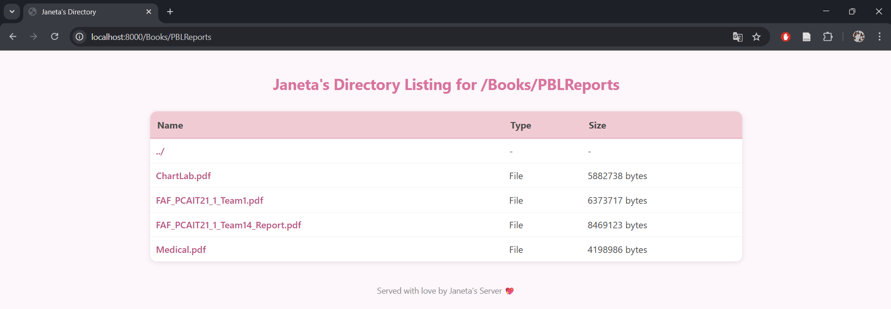
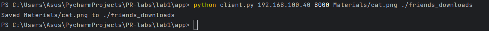

## 👩‍💻 Author
**Name:** Janeta Grigoras  
**Course:** PR Laboratory  
**Lab:** HTTP Server and Client (Single-threaded)

---

## 1. Source Directory Contents

The source directory contains:
 
- **collection/** – the folder served by the server, containing:
  - **index.html** – HTML page with a PNG image.  
  - **cute.png** – PNG image displayed in the HTML file.  
  - **doctor.png** – additional PNG image for testing image requests.  
  - **Books/** – subdirectory with additional files (for nested directory testing).  
- **downloads/** – directory where the client saves downloaded files from the server.  
- **friends_downloads/** – directory where files from a friend’s server are stored (bonus task). 
- **server.py** – the HTTP server script.  
- **client.py** – the HTTP client script. 
- **docker-compose.yml** – Docker Compose file.  
- **Dockerfile** – Dockerfile.  
- **README.md** – this lab report.  

## 2. Docker Setup
### 2.1. Dockerfile

This sets up Python 3.10, copies the server files into the container, exposes port 8000, and starts the server with the `collection` directory.

### 2.2. Docker-compose

Docker Compose makes running the container easier. It builds the image from the Dockerfile, gives the container a name (`http_server_lab1`), and maps port 8000 so we can open the server in a browser. It also connects the local app folder to the container, so any changes to the files are reflected inside the container automatically. Finally, it starts the server with the `collection` directory.

### 2.3. Starting the container
To start the server in Docker, we first build and run the container using Docker Compose.

This builds the image if it hasn't been built yet and starts the container. The server will now be running and accessible at `http://localhost:8000`. Any changes made to the local app folder will automatically appear inside the container.

### 2.4. Running the server inside the container

The command that runs the server inside the container is:

It tells Python to run the `server.py` script with unbuffered output, so any messages appear immediately in the terminal. The script then starts the HTTP server and serves all files from the `collection` directory. Once the server is running, it automatically listens for requests on port 8000 and responds with the requested files.

## 3. Served Directory Contents

The `collection` directory contains all the files that the server will serve.

**collection/** contains:
  - **index.html** – HTML page with a PNG image.  
  - **cute.png** – PNG image displayed in the HTML file.  
  - **doctor.png** – additional PNG image for testing image requests.  
  - **Books/** – subdirectory with:
    - **computer-networking-a-top-down-approach-8th-edition.pdf** – networking textbook.
    - **PBLReports/** – subdirectory with four additional PDF reports.

## 4. File Requests

### 4.1. Nonexistent file (404)

The following screenshot demonstrates that the server correctly handles requests for files that do not exist.
When the client requests a missing file, the server responds with the appropriate `404 Not Found` message.

### 4.2. HTML file with Embedded image

When the client requests an HTML page, the server reads the file and responds with the correct `text/html content` type.
The page is then displayed properly in the browser, including the embedded image it references.

### 4.3. PDF file

The following screenshot demonstrates that the server correctly handles requests for PDF files.
When the client requests a PDF document, the server locates the file in the served directory and sends it with the correct Content-Type header (`application/pdf`), allowing the file to be opened or downloaded successfully.

### 4.4. PNG file

The following screenshot shows that the server properly serves PNG image files.
When the client requests an image, the server responds with the appropriate `image/png` content type, and the image is correctly displayed in the browser.

## 5. Client

The Python client connects to the server and requests files using the HTTP protocol.
It takes four arguments: the `server host`, `port number`, the `requested filename`, and the `directory` where the file should be **saved**.

### 5.1. Running the client

This command connects to the server running on `localhost` at port `8000`, requests the file `cute.png`, and saves it inside the `downloads` folder.

### 5.2. Client Output

Here, we can see the output when requesting an HTML file (which is displayed directly in the console, not downloaded)

and when saving a PNG image to the downloads folder.

### 5.3. Saved files

The PNG and PDF files are saved locally in the specified directory:

## 6. Directory Listing

If the client requests a directory instead of a specific file, the server automatically generates a directory listing page.
This page shows all files and subdirectories contained within the requested folder.

Here's how the listing looks in the browser:

## 7. Browsing friend's Server

### Friend 1: Daniela Cojocari, FAF-231
Both computers were connected to the same Wi-Fi network, and we confirmed that port 8080 was open on both machines. We also made sure that the firewall on both laptops would not block the connection. Daniela ran the server on her computer, and we used ipconfig to find her local IP address. By entering her IP address and the port on which the server is hosted (like http://<friend_ip_address>:<friend_port>) in my browser, I was able to access the server and view its content.

Then, I used my client to download a file from her server. The screenshots below show the command I used and confirm that the download was successful.

 

 

### Friend 2: Anastasia Tiganescu, FAF-231

We connected both computers to the same Wi-Fi network and verified that port 8080 was open on both. We also checked that the firewall on both laptops would not interfere with the connection. Anastasia started the server on her machine, and I used ipconfig to get her local IP address. I accessed the server through my browser and could see the content hosted there.

Using my client, I downloaded a file from her server. 

 

## 6. Conclusions

In this lab, I implemented an HTTP server that handles HTML, PNG, and PDF files, including directory listings and 404 errors for missing files. I also created a Python client to request and download files from the server.  

I learned how servers and clients communicate using HTTP, how to manage different file types, and how to handle nested directories. Using Docker made it easier to run the server in a consistent environment.  

This experience will help me understand web servers, file handling, and network communication in future projects, and it gives me practical skills for testing and debugging client-server applications.

