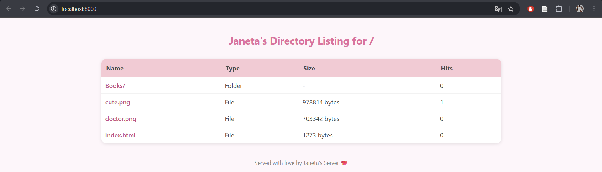

## 👩‍💻 Author
**Name:** Janeta Grigoras  
**Course:** PR Laboratory  
**Lab:** HTTP Server (Multi-threaded)

---

## 1. Source Directory Contents


The source directory contains:
 
- **collection/** – the folder served by the server, containing:
  - **index.html** – HTML page with a PNG image.  
  - **cute.png** – PNG image displayed in the HTML file.  
  - **doctor.png** – additional PNG image for testing image requests.  
  - **Books/** – subdirectory with additional files (for nested directory testing).  
- **server_multi.py** – the updated HTTP server script that can now handle multiple requests at the same time.  
- **client.py** – the HTTP client script (unchanged). 
- **docker-compose.yml** – Docker Compose file. 
- **testing.py** - script for testing concurrent requests.
- **Dockerfile** – Dockerfile.  
- **README.md** – this lab report.  

## 2. Docker Setup

The setup for Docker remains the same as in Laboratory Work 1, with only the name of the container changed and the command that starts the server.

### 2.1. Dockerfile


### 2.2. Docker-compose


## 3. Multithreaded server

### 3.1. Approach

In this lab, the HTTP server was modified to handle multiple client connections concurrently using multithreading. Each time a client connects to the server, a new thread is created to handle that specific request. This allows multiple clients to be served at the same time without blocking each other.

The key part of the implementation is:

```python
client_thread = threading.Thread(target=handle_client, args=(conn, base_dir))
client_thread.start()
```

Here:

* `threading.Thread` creates a new thread.

* `target=handle_client` specifies the function that will handle the client request.

* `args=(conn, base_dir)` passes the connection object and the directory to serve files from.

* `client_thread.start()` starts the thread immediately.

### 3.2. Running the server

Similar to Laboratory Work 1 to run the server we can use either

```python
python server_multi.py collection
```

or 

```python
docker-compose up --build
```

### 3.3. Testing concurrency

To test how the multithreaded server handles multiple requests, I wrote a small Python script that creates several threads, one for each request. Each thread connects to the server, asks for a file, and reads the response. The threads run at the same time, so multiple requests can be processed simultaneously.

Results for single-threaded server:


Results for multithreaded server:


Making the server multithreaded clearly improves performance under concurrent load, allowing requests to be processed simultaneously instead of sequentially.

## 4. Request Counter

### 4.1. Naive implementation

To count how many times each file is requested, I first tried a naive approach using a dictionary. For each request, the server would read the current count, wait a little `(time.sleep(0.1))`, and then increase the count by one:

```python
if full_path not in request_counts:
            request_counts[full_path] = 0
        current = request_counts[full_path]
        time.sleep(0.1)
        request_counts[full_path] = current + 1
```

The `time.sleep(0.1)` was added intentionally to make it easier to see **race conditions** when multiple threads tried to update the same counter at the same time.
I tested this by requesting the file `cute.png` `10` times. However, in the photo we can see that I got only `1` hits, meaning a race condition has appeared.




### 4.2. Thread-safe implementation

To fix the race condition from the naive counter, I used a thread lock `(counter_lock)` to make updates to the request counts thread-safe. Now, when a thread wants to update a counter, it first acquires the lock, ensuring that no other thread can change the counter at the same time:

```python
with counter_lock:
    if full_path not in request_counts:
        request_counts[full_path] = 0
    request_counts[full_path] += 1
```

After applying the lock, testing with concurrent requests showed that the counter now always increases correctly. The race condition is gone, and the request count reflects the actual number of hits for each file:


## 5. Rate limiting

### 5.1. Implementation

The server keeps track of how many requests each client IP makes within one second. If the number of requests goes over the limit (5), the server sends back a “429 Too Many Requests” page. 


I used a lock to make sure that updates to request_times are thread-safe and no two threads modify it at the same time.

### 5.2. Testing rate limiting

In the first test, I simulated spamming by sending 10 requests very quickly. The server applied the rate limit correctly, returning 5 successful responses (200 OK) and 5 blocked ones (429 Too Many Requests). Because half of the requests were rejected, the throughput was lower — around 0.79 successful requests per second.


In the second test, I sent the same number of requests but at a slower pace, staying under the rate limit. All 10 requests were successful, and the throughput increased to 1.47 successful requests per second. This shows that the rate limiting mechanism works as intended, limiting excessive traffic while maintaining high performance for normal users.


## 6. Conclusions

From this lab, I learned that multithreading helps a server handle multiple client requests at the same time, making it much faster and more responsive. I also understood how important thread safety is,s without it, shared data like counters can cause race conditions and give wrong results. Rate limiting was another useful concept; it helps control how often clients can send requests and prevents overloading the server. Comparing both types, the multithreaded server clearly performs better than the single-threaded one since it can manage several connections at once. I also improved my practical skills in using threads, synchronization with locks, and implementing rate limiting, similar to what we did in Laboratory Work 1 1.