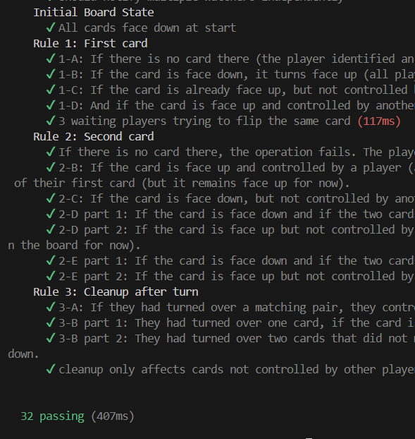
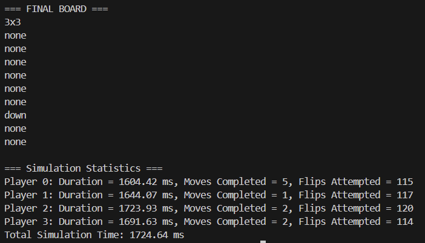

# MIT 6.102 (Spring 2025) Problem Set 4: Memory Scramble

The code provided for
[https://web.mit.edu/6.102/www/sp25/psets/ps4](https://web.mit.edu/6.102/www/sp25/psets/ps4).

## Running

The frontend consists of a single static file, `./public/index.html`.

The backend has to be written by you.
You can use any language and libraries.

This repository contains a starting point for the backend written in TypeScript.
You can run it like this:
```
npm install
npm start
```
## 👩‍💻 Author
**Name:** Janeta Grigoras  
**Course:** PR Laboratory  
**Lab:** Memory Scramble

## Purpose 
The purpose of this lab is to implement a fully functional Board Abstract Data Type (ADT) for the Memory Scramble game and to explore how concurrent player actions interact with the board. The lab emphasizes designing a system that enforces game rules correctly while maintaining consistency and integrity, even when multiple players are performing actions at the same time. This includes handling card flips, matches, removals, and providing player-specific views of the board state.

## Objectives
1. To implement the Board ADT with correct handling of card states (face up, face down, removed) and player control.
2. To ensure concurrency safety, allowing multiple players to interact with the board simultaneously without breaking game consistency.
3. To design a map function that can transform the board asynchronously while maintaining atomicity for matching cards.
4. To write comprehensive tests verifying the board’s behavior, including edge cases and interleaving operations.
5. To simulate realistic gameplay scenarios to observe and validate the system’s behavior under multiple concurrent actions.

## Board ADT Design
The `Board ADT` consists of several components that together implement the Memory Scramble game: types, helper classes, and the main board ADT.

### Components
* `Cell:` Represents a card on the board, including its value, whether it is face up, and which player (if any) currently controls it.
* `Player:` Represents a player, tracking their ID, the cards they have flipped this turn (if they flipped any), and whether they have found a match.
* `Resolver<T>` and `Rejector:` Function types used for resolving or rejecting promises in asynchronous operations.
* `Deferred<T>:` Wraps a promise and exposes its resolve and reject functions. Used to handle players waiting to flip cards controlled by others, allowing safe asynchronous interactions.

### Main Board ADT - `Board`
#### Abstraction Function(AF):
The board represents a `rows × cols` grid of cards. Each cell may contain a card or be empty. For each cell:

* `value` is the card’s string value, or null if removed.
* `faceUp` indicates whether the card is visible.
* `controlledBy` shows the player currently controlling the card, or null if uncontrolled.

Players are tracked in the `players` map:

* `firstCard` and `secondCard` store the positions of cards flipped this turn.
* `hasMatched` indicates if the player found a matching pair.
* `boardChangeCallbacks` stores functions to call when the board state changes. These callbacks represent “watching” players.
* `waiters` stores queues of players waiting to flip specific cards that are currently controlled by other players.

#### Representation Invariant (RI):

* The grid matches the declared `rows` and `cols`.
* Removed cards are always face-down and uncontrolled.
* Controlled cards are always face-up and have a value.
* Each player controls at most two cards.
* Player states are consistent with the grid.
* All cell values are defined (never undefined).

#### Safety from Representation Exposure:

* All fields are private.
* Internal mutable structures are never returned directly.
* Deep copies are created when parsing from file or performing updates.
* checkRep() validates the RI after every modification.

## Core operations
The Board ADT provides several public methods that define how players interact with the game and how the board state can be manipulated. These core operations handle all the game rules, enforce concurrency safety, and ensure a consistent state.

1. `parseFromFile(filename: string: Promise<Board>`: 

    Loads a board layout from a file and validates its structure. It ensures the first line specifies the board dimensions in `ROWxCOLUMN` format, and each subsequent line contains valid card values. This method constructs a new Board instance with a deep copy of the grid and calls `checkRep()` to verify the representation invariants.

2. `flip(playerId: string, row: number, col: number): Promise<void>`

    The main operation for player interaction. When a player flips a card, the Board ensures that:

    * Any unfinished turn from the same player is completed first, by calling `finishPreviousTurn()`, which flips back unmatched cards or removes matched pairs.
    * Depending on whether this is the player’s first or second card of the turn, `flipFirst()` or `flipSecond()` is called. These helpers handle the detailed logic of flipping, checking for matches, and enforcing the rules.
    * If a card is already controlled by another player, the player waits asynchronously using the `Deferred` mechanism until the card becomes available.
    * Once the flip logic completes, `triggerBoardChange()` notifies any players watching the board of the update.

    This method maintains concurrency safety, allowing multiple players to interact with the board simultaneously without corrupting the state.

3. `look(playerId: string): string`
    Generates a player-specific string representation of the board. Cards are shown differently depending on whether they are face down, controlled by the player, or visible but controlled by another player. This method provides a consistent view of the board without exposing the internal mutable state.
4. `map(playerId: string, f: (card: string) => Promise<string>): Promise<void>`

    Applies an asynchronous function to transform the values of all cards on the board. Each unique card value is mapped once, and the results are applied back to the board. During this operation, other player actions can still occur, ensuring that the game remains concurrent. Once mapping is complete, `triggerBoardChange()` is called to notify watchers, and `checkRep()` ensures the board remains in a valid state.
5. `watch(playerId: string): Promise<void>`

    Allows a player to wait for the next board change. When a change occurs, the promise resolves, giving the player an updated view. Internally, this method registers a callback in `boardChangeCallbacks`, which is triggered by any operation that modifies the board.

## Testing
The testing strategy for the Board module focuses on verifying that the game behaves correctly under all conditions described in the specification, including input validation, gameplay logic, state transitions, and concurrency handling. The tests ensure that both the public methods and their interactions maintain the board’s integrity and enforce the rules of Memory Scramble.
### Approach
Tests are designed to check multiple aspects of the Board:

* Input validation: ensuring that malformed files, invalid dimensions, and missing cards are rejected by `parseFromFile()`.
* Gameplay logic: verifying that flipping cards, matching pairs, relinquishing control, and removing cards follow the rules.
* State transitions: confirming that cards change state appropriately between `down`, `up card`, `my card`, and `none`, and that cleanup after each turn is correct.
* Concurrency and waiting behavior: testing that multiple players interacting with the same card are handled safely, using `Deferred` promises for waiting.
* Transformations: ensuring that `map()` correctly applies asynchronous functions to card values without breaking game logic, including partially completed operations or concurrent maps.
* Player-specific views: `look()` tests confirm that each player sees cards from their own perspective, respecting control and visibility rules.
* Notifications: `watch()` tests verify that players are notified of board changes, including flips, removals, and transformations.

### Organization
Tests are grouped by the functionality they target:

1. `parseFromFile`: checks valid board loading, invalid dimensions, empty cells, and card counts.
2. `look()`: validates the view of cards for a single player under different states (my, up, none).
3. `map()`: ensures asynchronous transformations of card values, proper handling of face-up and face-down cards, concurrent mapping, and preservation of matching pairs.
4. `watch()`: tests notification delivery for flips, removals, and map transformations, and ensures multiple watchers are notified independently.
5. `Initial Board State`: confirms all cards start face down.
6. `Rules for flipping cards`: split into `Rule 1 (first card)`, `Rule 2 (second card)`, and `Rule 3 (cleanup after turn)`, covering edge cases like missing cards, controlled/uncontrolled cards, matches, non-matches, and waiting behavior.

All the tests in this suite are passing, confirming that the Board module behaves according to the specification and that its operations are correctly implemented and concurrency-safe



## Simulation

The simulation demonstrates multiple players interacting concurrently with the Board. Four players attempt 100 moves each on a 3×3 board, with random delays between flips to mimic real gameplay. Each player flips two cards per turn, waiting if a card is controlled by another player or invalid.

The purpose of the simulation is to verify that the game never crashes under concurrent actions. At the end, the final board state is displayed, and each player’s statistics `moves completed`, `flips attempted`, and `duration` are reported. This confirms that the Board enforces game rules, handles concurrency safely, and maintains a consistent state throughout.



## Conclusion
Working on the Memory Scramble board project taught me a lot about handling concurrent systems. I learned how to make sure that multiple players can interact with the board at the same time without breaking the game state. I also got better at using abstract data types and helper classes, and at keeping the design clear with representation invariants and abstraction functions.

Writing the tests helped me think carefully about edge cases, asynchronous behavior, and making sure all the game rules are followed. Running the simulation showed me how concurrency works in practice and confirmed that the game can handle multiple players safely.

Overall, this project helped me improve my skills in designing safe and reliable software. It will definitely help me in future projects where I need to manage shared state, reason about correctness, and write code that works well even in complex scenarios.