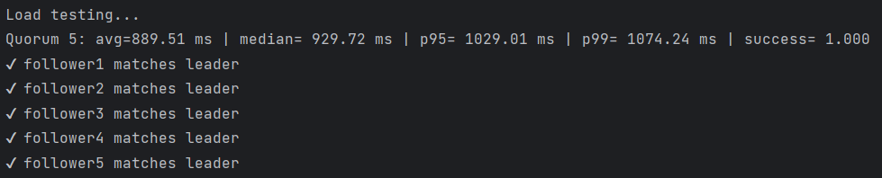
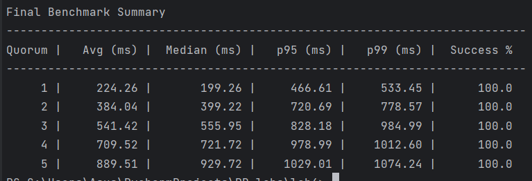
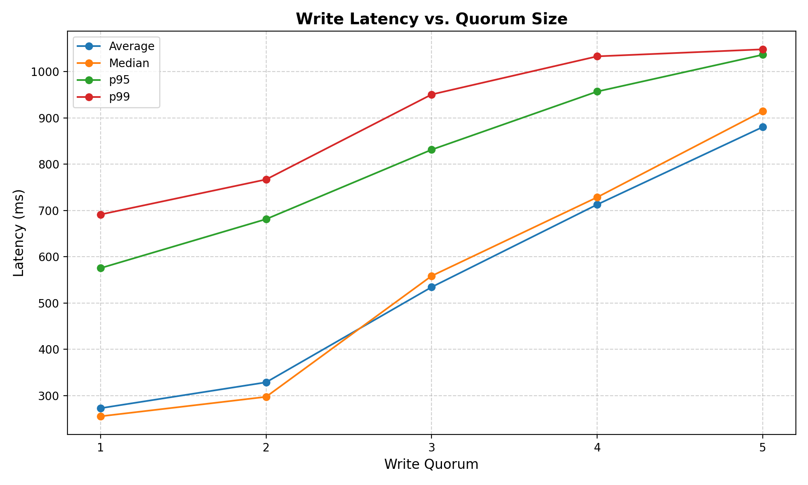

## 👩‍💻 Author
**Name:** Janeta Grigoras  
**Course:** PR Laboratory  
**Lab:** Leaders and followers

---

## 1. Source Directory Contents
The source directory contains:
 
- **src/app.py** – unified server implementation that behaves as a leader or follower depending on environment variables.
- **tests/**
  - **integration_test.py** – script verifying correct replication and data consistency across all nodes.
  - **performance_test.py** – script measuring write latency under different quorum configurations and checking success rates.
- **docker-compose.yml** – configuration for running one leader and five followers as separate containers.
- **Dockerfile** – base image setup for the server application and dependencies.
- **report_images/** – folder containing screenshots, plots, and logs used in this report.
- **README.md** – this lab report.
```
lab4
│
├── src/
│   └── app.py
├── tests/
│   ├── integration_test.py
│   └── performance_test.py
├── docker-compose.yml
├── Dockerfile
├── report_images/
└── README.md
```


## 2. Docker Setup

To run the distributed system, I used Docker Compose to launch one `leader` and five `follower` containers, all running the same `app.py` script but configured differently through environment variables.
### 2.1. Dockerfile

The Dockerfile uses a lightweight Python base image and installs Flask + Requests to support HTTP communication.
It copies the application code into the container and exposes port 5000, since all services listen on the same internal port.
```dockerfile
FROM python:3.10-slim

WORKDIR /app

COPY src/app.py /app/

RUN pip install flask requests

EXPOSE 5000

CMD ["python", "app.py"]
```

### 2.2. Docker-compose

This file defines the deployment of all six nodes:
- leader
- follower1–follower5

```yaml
services:

  leader:
    build: .
    container_name: leader
    environment:
      - ROLE=leader
      - FOLLOWERS=http://follower1:5000,http://follower2:5000,http://follower3:5000,http://follower4:5000,http://follower5:5000
      - WRITE_QUORUM=${WRITE_QUORUM:-1}
      - MIN_DELAY=0
      - MAX_DELAY=1000
    ports:
      - "5000:5000"

  follower1:
    build: .
    container_name: follower1
    environment:
      - ROLE=follower
    ports:
      - "5001:5000"

  follower2:
    build: .
    container_name: follower2
    environment:
      - ROLE=follower
    ports:
      - "5002:5000"

  follower3:
    build: .
    container_name: follower3
    environment:
      - ROLE=follower
    ports:
      - "5003:5000"

  follower4:
    build: .
    container_name: follower4
    environment:
      - ROLE=follower
    ports:
      - "5004:5000"

  follower5:
    build: .
    container_name: follower5
    environment:
      - ROLE=follower
    ports:
      - "5005:5000"

```
## 3. Single-Leader Replication System

### 3.1. Approach
This application runs in two different modes depending on the environment variable:
```python
ROLE = os.getenv("ROLE", "follower")
```

- If `ROLE="leader"` → enables write and replication logic 
- If `ROLE="follower"` → only accepts replicated updates

This ensures that only the leader handles client writes.

### 3.1. Leader Behavior
When the leader receives a write request `(/write)`:
```python
version = get_next_version()
apply_local(key, value, version)
success, acks = replicate_to_followers(key, value, version)
```

The leader:
1. Generates a new version number
2. Stores the (key, value) locally
3. Sends replication requests to all followers concurrently
4. Waits until **WRITE_QUORUM** followers acknowledge before confirming success

The replication is done using a thread pool:
```python
futures = []
for fol in FOLLOWERS:
  future = executor.submit(replicate_to_one_follower, fol, key, value, version)
  futures.append(future)
```

As soon as enough followers confirm:
```python
if ack_count >= WRITE_QUORUM:
  return True, ack_count
```

→ Write is committed. If quorum is not reached → the write fails.

### 3.2. Network Delay Simulation

To simulate real distributed environments:
```python
delay = random.uniform(MIN_DELAY, MAX_DELAY) / 1000
time.sleep(delay)
```

Each follower might respond slower or faster.
This directly affects latency results in the performance test.
### 3.3. Followers
Followers do not accept writes directly.
They only apply updates received from the leader:

```python
if ROLE == "follower":
    @app.route("/replicate", methods=["POST"])
    def replicate():
        data = request.get_json()
        if not data or "key" not in data or "value" not in data:
            return jsonify({"error": "Invalid request"}), 400

        key = data["key"]
        value = data["value"]
        version = data.get("version", 0)

        apply_local(key, value, version)
        return jsonify({"status": "replicated"}), 200
```
The version field ensures a follower never overwrites a newer update:
```python
def get_next_version():
    global current_version

    with current_version_lock:
        current_version += 1
        return current_version
```
This prevents conflicts when replicas receive messages in different orders.

### 3.4. API Endpoints
- `/write` → client writes to leader 
- `/replicate` → leader sends updates to followers 
- `/dump` → used to check if all data matches after testing 
- `/read` → read stored values 
- `/ping` → health checks used by the test script
## 4. Integration and Performance Testing
To validate both the correctness and performance of the replication system, I created and executed two separate test scripts: `integration_test.py` and `performance_test.py`.
### 4.1. `integration_test.py`

This script focuses on correctness. It runs a sequence of functional tests that simulate realistic usage scenarios. It starts with a basic write/read check to confirm that data written to the leader is correctly replicated to all followers. Then it verifies that if a key is overwritten, all replicas store only the most recent version, proving correct “last write wins” behavior. The script also ensures that followers correctly reject direct write attempts — only the leader should handle client writes. To test concurrency, many writes are performed at the same time, and the script checks that version ordering remains intact and no updates are lost. In the final check, the entire contents of every follower are compared against the leader, confirming full data consistency across the cluster. All tests in this script passed successfully, meaning the system behaves correctly under all tested conditions.


### 4.2. `performance_test.py`

The second script measures how the system performs under load. Around 100 writes are executed concurrently while gradually increasing the write quorum from 1 to 5. For each quorum value, the script measures the latency of the write operations, including average time, median time, and the slowest cases (p95/p99).







The results showed that when the quorum is small, writes complete much faster because the leader does not need to wait for every follower. As the quorum increases, the leader must wait for more acknowledgments, which significantly increases the latency, especially when slower followers are involved. Even with these delays, every write still succeeded, and at the end of each performance run, all followers contained the exact same data as the leader. This confirms that the system maintains full consistency even under stress.

## 5. Conclusions

In this lab, I learned how a leader–follower architecture works in practice and how data replication is managed in distributed systems. I implemented a leader that handles all writes and followers that only apply replicated updates, and I used write quorums to control consistency levels. Through performance testing, I clearly saw how increasing the quorum affects latency and reliability.

I also improved my skills in working with concurrency, versioning, Docker, and network delays. Overall, this lab helped me understand the real challenges of keeping data consistent across multiple servers and gave me hands-on experience with concepts used in real-world distributed systems.